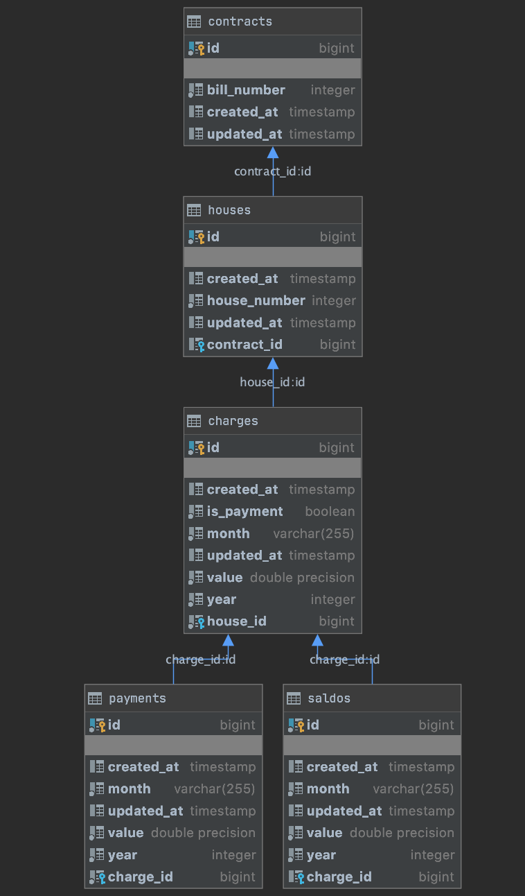

# Лабораторная работа
Разработать веб-приложение по теме ЖКХ с возможностью создания счетов, оплаты, расчета задолжностей.

## Что использовалось
* Kotlin
* Postgresql
* Spring boot
* Hibernate
* Swagger

### Документация RESTful API
Документация представлена в формате OpenAPI, а именно с помощью Swagger по адресу
```http://localhost:8080/swagger-ui.html```

## Схема базы данных

